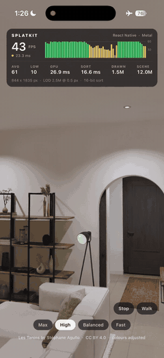

# SplatKit

Native Gaussian splatting SDKs for iOS/Metal, Android/Vulkan and React Native, sharing a C++17 engine.
Experimental alpha: APIs and quality/performance tradeoffs are still evolving.

[](https://central.sonatype.com/artifact/io.github.xget7/splatkit-android)
[](https://github.com/Xget7/splatkit-ios/releases)
[](https://www.npmjs.com/package/@splatkit/react-native)
[](LICENSE)
[](https://github.com/Xget7/splatkit/actions/workflows/android.yml)
[](https://github.com/Xget7/splatkit/actions/workflows/ios.yml)

[Android API](packages/splatkit-android/README.md) | [iOS / SwiftPM](https://github.com/Xget7/splatkit-ios) | [React Native](packages/react-native-splatkit/README.md) | [Agent harness](docs/AGENT_HARNESS.md) | [Changelog](CHANGELOG.md)



## Use

Android: API 29+, Vulkan 1.1, arm64-v8a.
The GPU path additionally checks subgroup and memory limits.
Maven Central has `io.github.xget7:splatkit-android:0.1.0-alpha09`, with host-driven walking, the render policy and `onWorldFrameReady`; see the [Android releases](https://github.com/Xget7/splatkit/releases).
To build current source:

```sh
cd apps/android-dev
./gradlew :splatkit:assembleRelease :splatkit:testDebugUnitTest
```

iOS: add [splatkit-ios](https://github.com/Xget7/splatkit-ios) to Swift Package Manager, version `0.1.0-alpha.5`.
Use the native view, forward lifecycle and load worlds asynchronously; see each SDK's README for examples.

Worlds are `.spz` or `.lodsplat`, prepared on a computer.
World Labs Marble exports load as they are; any Gaussian splat PLY goes through one command:

```sh
scripts/prepare-world.sh scene.ply out/ --collider   # --lod for scenes of several million splats
```

[Preparing a world](packages/react-native-splatkit/README.md#preparing-a-world) explains each flag and its cost.

## Implemented scope

| Capability | Metal | Vulkan |
|---|---|---|
| GPU visibility, compaction, stable radix, indirect drawing | Yes | Yes, capability-gated |
| Offline `.lodsplat` and GPU hierarchical selection | Yes | Yes |
| 16-bit quantized depth / two radix passes | Per-view policy approximation | Per-view policy approximation |
| SH degrees 0–3, walk/fly, touch, motion, loaded/drawn stats | Yes | Yes |
| Per-view render policy and capabilities | Yes | Yes |
| React Native policy prop and events | iPhone 17 Pro validated | Mi 9 validated |

React Native: `npm install @splatkit/react-native@next`, published from [react-native-splatkit](https://github.com/Xget7/react-native-splatkit); the [example app](apps/react-native/README.md) starts from zero.
One policy prop drives both adapters.

`splat-core` owns formats, hierarchy and navigation; `splatkit-engine` owns orchestration; each native SDK owns its GPU resources and view lifecycle.
CPU loading/preprocessing and a bounded compatibility ordering path remain.
GPU rendering does not mean zero CPU work.

## Validation and limits

Vulkan stable-sort (through 3M), visibility, LOD-to-indirect and upload-pressure suites pass on an arm64 emulator and on a physical Mi 9 (Adreno 640).
On that Mi 9, kitchen 500k and house 2M render with Vulkan validation on, and 30-second turns are logged in the [benchmarks](docs/BENCHMARKS.md).
These are correctness checks and short runs, **not sustained benchmarks**; Mali is untested.

Vulkan limits include at most 3M visibility survivors and 2.2M LOD-selected nodes.
Overflow fails closed; source residency depends on driver buffer limits and available memory.
LOD parents, subpixel culling and depth quantization can change the image.
There is no universal 10M/30/60 FPS or lossless guarantee.

[Backend contracts/evidence](packages/splatkit-android/docs/VULKAN.md) | [Parity gates](docs/VALIDATION.md#remaining-parity-gates) | [Historical device measurements](docs/BENCHMARKS.md)

## Known gaps - contributions welcome

These are the things we know are missing.
We would love help with any of them.

- **Other GPUs.** Android is tested on one Adreno 640 phone, and Mali is untested.
- **Lifecycle stress.** Backgrounding, rotating, switching worlds and recycling views work in normal use, but nobody has hammered them for leaks.
- **Long sessions.** Our runs are minutes long, not hours; thermal behaviour over time is unmeasured.
- **Very large worlds.** LOD limits what is drawn, not what is loaded, so the whole hierarchy stays in memory.
  A 13M node world raises memory warnings even on an iPhone 17 Pro.
- **Metal and Vulkan side by side.** There is no automated image comparison between the two backends yet.

A bug report is most useful with the device and GPU, OS version, world format and size, render settings and logs.
To send code, start with the [build guide](CONTRIBUTING.md), the [validation gates](docs/VALIDATION.md) and the [agent harness](docs/AGENT_HARNESS.md).

[MIT license](LICENSE) and [third-party licenses](THIRD_PARTY_LICENSES.txt).
